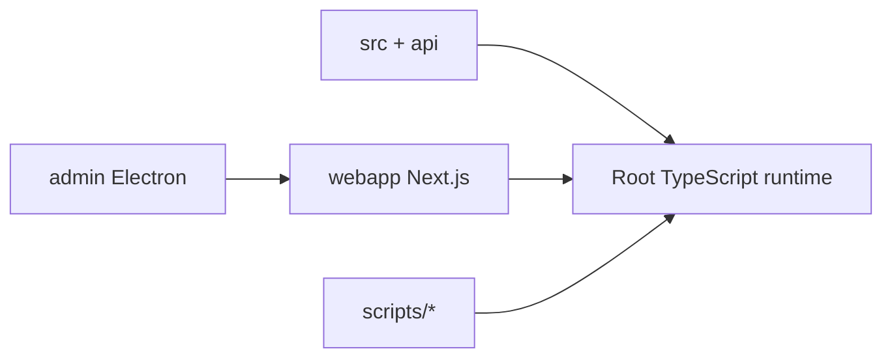

# GXQ STUDIO - Advanced Solana DeFi Platform

[](https://github.com/SMSDAO/TradeOS/actions/workflows/ci.yml)
[](https://github.com/SMSDAO/TradeOS/actions/workflows/codeql-analysis.yml)
[](https://codecov.io/gh/SMSDAO/TradeOS)
[](https://github.com/SMSDAO/TradeOS/actions/workflows/deploy-preview.yml)
[](https://github.com/SMSDAO/TradeOS/actions/workflows/deploy-railway.yml)
[](https://github.com/SMSDAO/TradeOS/actions/workflows/omega-docs-refresh.yml)

The most advanced Solana DeFi platform with flash loan arbitrage, sniper bot, token launchpad, and comprehensive Web3 UI.

## 🚀 Quick Start

```bash
# Interactive setup
./quick-start.sh

# Or use Make commands
make help          # Show all available commands
make dev           # Start local development
make docker-up     # Start with Docker
```

### 🧠 Realise (Production Bootstrap)

```bash
powershell -ExecutionPolicy Bypass -File ./scripts/Bootstrap.ps1
```

- Runs environment checks (Node.js + npm)
- Installs dependencies (root + webapp + optional `apps/api`)
- Initializes `.env` files from examples when missing
- Builds the project (unless `-SkipBuild` is passed)

`No-Drift` completion tag: `v1.0.0-STABLE` @ `2026-04-21T10:30:49.889+00:00`



## 📦 Deployment Options

**Deploy to any platform in minutes!** See [DEPLOYMENT.md](DEPLOYMENT.md) for comprehensive guides.

| Platform | Best For | Command | Guide |
|----------|----------|---------|-------|
| 🌐 **Vercel** | Webapp (Serverless) | `vercel --prod` | [Guide](DEPLOYMENT.md#vercel-serverless) |
| 🚂 **Railway** | Backend (Container) | `railway up` | [Guide](DEPLOYMENT.md#railway-container) |
| ☁️ **AWS** | Enterprise Scale | `make deploy-aws` | [Guide](DEPLOYMENT.md#aws) |
| 🔷 **Azure** | Microsoft Cloud | `make deploy-azure` | [Guide](DEPLOYMENT.md#azure) |
| 🐳 **Docker** | Any Server | `make docker-up` | [Guide](DEPLOYMENT.md#docker) |
| 💻 **VPS** | Full Control | `make deploy-vps` | [Guide](DEPLOYMENT.md#vps-manual) |
| 🏠 **Localhost** | Development | `make dev` | [Guide](DEPLOYMENT.md#localhost) |

### Key Features
- ✅ **Unified Server**: Single entry point for all deployments
- ✅ **Docker Orchestration**: Backend + Webapp + Monitoring
- ✅ **50+ Make Commands**: Simplified management
- ✅ **Automated Scripts**: One-command VPS deployment
- ✅ **Health Checks**: Kubernetes-compatible endpoints
- ✅ **WebSocket Support**: Real-time updates with auto-reconnect
- ✅ **Monitoring**: Prometheus + Grafana integration

## 🆕 Latest Updates

**✨ Multi-Platform Deployment Support**

- ✅ **Unified Server**: `src/server.ts` works across all platforms
- ✅ **Docker Excellence**: Multi-stage builds, dev & prod configs
- ✅ **Comprehensive Docs**: 26KB deployment guide covering 8+ platforms
- ✅ **Automation**: Makefile with 50+ commands, deployment scripts
- ✅ **CI/CD**: Docker build workflow, automated testing
- ✅ **WebSocket Stability**: Enhanced reconnection logic

**✨ Production-Ready API with Comprehensive Validation & Automated Deployment**

- ✅ **Input Validation**: Comprehensive validation for all API endpoints with type checking and sanitization
- ✅ **Error Handling**: Centralized error handling with standardized responses and custom error types
- ✅ **CORS Configuration**: Production-ready CORS with environment-aware configurations
- ✅ **Automated Deployment**: CI/CD workflows for Vercel and Railway with health checks and auto-rollback
- ✅ **Enhanced Security**: Rate limiting, input sanitization, and authentication validation
- ✅ **Complete Documentation**: Comprehensive guides for API, validation, deployment, and configuration

📖 **[Deployment Guide](./DEPLOYMENT.md)** | **[Quick Start](./docs/QUICK_START.md)** | **[API Validation](./docs/API_VALIDATION.md)**

## 🌐 Web Application (NEW!)

**Production-ready Next.js web app with full Solana integration!**

### Features
- 🔄 **Jupiter Swap** - Best rates across all Solana DEXs
- 🎯 **Sniper Bot** - Monitor and snipe new token launches (Pump.fun + 8-22 DEXs)
- 🚀 **Token Launchpad** - Launch tokens with 3D airdrop roulette game
- 🎁 **Airdrop Checker** - Wallet scoring and auto-claim with Jupiter integration
- 💎 **Staking** - Marinade, Lido, Jito, Kamino integration
- ⚡ **Flash Loan Arbitrage** - Real-time opportunity scanning and execution
- 📱 **Responsive Design** - Mobile, tablet, and desktop optimized
- 🎨 **Modern UI** - Solana-themed with purple, blue, green gradients and 3D effects

### Quick Deploy to Vercel

[](https://vercel.com/new/clone?repository-url=https://github.com/SMSDAO/TradeOS&root=webapp&env=NEXT_PUBLIC_RPC_URL&envDescription=Solana%20RPC%20URL%20(premium%20recommended%2C%20default%3A%20public%20mainnet)&envLink=https%3A%2F%2Fgithub.com%2FSMSDAO%2FTradeOS%2Fblob%2Fmain%2F.env.example&project-name=gxq-studio&repository-name=TradeOS)

**⚠️ IMPORTANT**: The deploy button above pre-configures Root Directory to `webapp`. If importing manually, set **Root Directory** to `webapp` in the project settings.

#### Via Vercel Dashboard (manual):
1. Go to https://vercel.com/new
2. Import: `SMSDAO/TradeOS`
3. **Set Root Directory**: `webapp` ← **REQUIRED**
4. Add env: `NEXT_PUBLIC_RPC_URL`
5. Deploy

#### Via Vercel CLI:
```bash
cd webapp
vercel --prod
```

See [VERCEL_DEPLOYMENT_CASTQUEST.md](VERCEL_DEPLOYMENT_CASTQUEST.md) for detailed instructions and troubleshooting.

### Quick Deploy to Railway

**Railway provides 24/7 backend hosting with automated arbitrage scanning!**

[](https://railway.app/template/SMSDAO/TradeOS?referralCode=gxq)

#### Automated Setup:
```bash
bash scripts/setup-railway.sh
```

#### Manual Setup:
```bash
# Install Railway CLI
curl -fsSL https://railway.app/install.sh | sh

# Login and link to project
railway login
railway link 2077acd9-f81f-47ba-b8c7-8bf6905f45fc

# Set environment variables
railway variables --set SOLANA_RPC_URL="your-rpc-url"
railway variables --set WALLET_PRIVATE_KEY="your-private-key"

# Deploy
railway up
```

**Features:**
- ✅ 24/7 automated arbitrage scanning
- ✅ Auto-deployment on push to main
- ✅ Preview deployments for PRs
- ✅ Health check monitoring with auto-restart
- ✅ Secret synchronization workflow
- ✅ Automatic rollback on failure
- ✅ Real-time logs and metrics

**Required Secrets:**
- `RAILWAY_TOKEN` - Railway API token
- `RAILWAY_PROJECT_ID` - `2077acd9-f81f-47ba-b8c7-8bf6905f45fc`
- `SOLANA_RPC_URL` - Solana RPC endpoint
- `WALLET_PRIVATE_KEY` - Wallet private key (base58)
- `ADMIN_USERNAME` - Admin username
- `ADMIN_PASSWORD` - Admin password
- `JWT_SECRET` - JWT secret

📖 See [docs/RAILWAY_DEPLOYMENT.md](docs/RAILWAY_DEPLOYMENT.md) for complete Railway deployment guide.

## 🚀 Backend CLI Features

### QuickNode Integration
- **RPC**: High-performance Solana RPC endpoint
- **Functions**: Serverless compute for price monitoring
- **KV Store**: Key-value storage for opportunity caching
- **Streams**: Real-time blockchain event monitoring

### Flash Loan Providers (5 Providers)
- **Marginfi** - 0.09% fee
- **Solend** - 0.10% fee
- **Kamino** - 0.12% fee
- **Mango** - 0.15% fee
- **Port Finance** - 0.20% fee

### DEX Integrations (11 Programs)
- Raydium
- Orca
- Serum
- Saber
- Mercurial
- Lifinity
- Aldrin
- Crema
- **Meteora** (mainnet-grade)
- **Phoenix** (mainnet-grade)
- **OpenBook** (mainnet-grade)

### Arbitrage Strategies
- ⚡ **Flash Loan Arbitrage**: Leverage flash loans from 5 providers with fees ranging from 0.09%-0.20%
- 🔄 **Triangular Arbitrage**: Multi-hop trading using Jupiter v6 aggregator
- 🎯 **Hybrid Strategy**: Combine both approaches for maximum profitability

### Token Support (30+ Tokens)
- **Native**: SOL, wSOL, RAY, ORCA, MNGO, SRM, JUP, RENDER, JTO, PYTH, STEP
- **Stablecoins**: USDC, USDT, USDH, UXD, USDR
- **Liquid Staking Tokens**: mSOL, stSOL, jitoSOL, bSOL, scnSOL
- **Memecoins**: BONK, WIF, SAMO, MYRO, POPCAT, WEN
- **GXQ Ecosystem**: GXQ, sGXQ, xGXQ

### Enhanced Scanner (NEW!)
- 🔍 **Multi-Angle Scanning**: Flash loan, triangular, and cross-DEX arbitrage detection
- ⚡ **1-Second Polling**: Real-time opportunity detection with configurable intervals
- 🌐 **20+ Aggregators**: Jupiter + 12 direct DEX integrations for comprehensive coverage
- 💾 **Historical Analysis**: Database-backed tracking and analytics
- 📊 **Dynamic Gas Estimation**: Real-time compute unit estimation via Solana RPC
- 🎯 **User-Configurable Slippage**: Set maximum slippage tolerance
- 🔔 **Live Notifications**: Real-time alerts for profitable opportunities
- 📈 **Performance Metrics**: Detailed statistics and success rate tracking

### Additional Features
- 🎁 **Airdrop Checker**: Automatic detection and claiming of airdrops
- 📋 **Preset Management**: Pre-configured strategies for different market conditions
- 🛡️ **MEV Protection**: Jito bundle integration to prevent front-running
- ⚡ **Auto-Execution**: Continuous monitoring and execution of profitable opportunities
- 🔧 **Manual Execution**: Review and manually execute opportunities with "sweet profit"
- 💰 **Dev Fee System**: Automatic 10% profit sharing to development wallet
- 💎 **GXQ Ecosystem Integration**: Native support for GXQ tokens

## 📦 Installation

```bash
# Clone the repository
git clone https://github.com/SMSDAO/TradeOS.git
cd TradeOS

# Install dependencies
npm install

# Build the project
npm run build
```

## ⚙️ Configuration

Copy the example environment file and configure your settings:

```bash
cp .env.example .env
```

Edit `.env` with your configuration:

```env
# Solana Configuration
SOLANA_RPC_URL=https://api.mainnet-beta.solana.com
WALLET_PRIVATE_KEY=your_private_key_here

# QuickNode Configuration
QUICKNODE_RPC_URL=your_quicknode_rpc_url
QUICKNODE_API_KEY=your_quicknode_api_key
QUICKNODE_FUNCTIONS_URL=your_quicknode_functions_url
QUICKNODE_KV_URL=your_quicknode_kv_url
QUICKNODE_STREAMS_URL=your_quicknode_streams_url

# Arbitrage Configuration
MIN_PROFIT_THRESHOLD=0.005
MAX_SLIPPAGE=0.01
GAS_BUFFER=1.5

# Dev Fee Configuration (10% of profits)
DEV_FEE_ENABLED=true
DEV_FEE_PERCENTAGE=0.10
DEV_FEE_WALLET=monads.solana
```

## 🎯 Usage

### Check Available Airdrops
```bash
npm start airdrops
```

### Auto-Claim Airdrops
```bash
npm start claim
```

### List Available Presets
```bash
npm start presets
```

### Scan for Opportunities
```bash
npm start scan
```

### Start Auto-Execution
```bash
npm start start
```

### Manual Execution Mode
Review opportunities before executing:
```bash
npm start manual
```

### Show Flash Loan Providers
```bash
npm start providers
```

### Enhanced Scanner (NEW!)
**Real-time multi-angle arbitrage detection with 1-second polling:**
```bash
# Start enhanced scanner
npm start enhanced-scan

# View scanner statistics
npm start scanner-stats

# View database statistics
npm start db-stats

# Historical analysis
npm start history
```

See [ENHANCED_SCANNER.md](ENHANCED_SCANNER.md) for complete documentation.

## 📋 Preset Strategies

### 1. Stablecoin Flash Loan Arbitrage
- **Strategy**: Flash loan arbitrage with stablecoins
- **Tokens**: USDC, USDT, USDH, UXD
- **Risk**: Low
- **Min Profit**: 0.3%

### 2. SOL Triangular Arbitrage
- **Strategy**: Triangular arbitrage with SOL
- **Tokens**: SOL, USDC, USDT, RAY, ORCA
- **Risk**: Medium
- **Min Profit**: 0.5%

### 3. Liquid Staking Token Arbitrage
- **Strategy**: Hybrid approach with LSTs
- **Tokens**: SOL, mSOL, stSOL, jitoSOL, bSOL
- **Risk**: Low-Medium
- **Min Profit**: 0.4%

### 4. Memecoin Flash Arbitrage
- **Strategy**: High-frequency memecoin trading
- **Tokens**: BONK, WIF, SAMO, MYRO, POPCAT
- **Risk**: High
- **Min Profit**: 1.0%

### 5. GXQ Ecosystem Arbitrage
- **Strategy**: GXQ token ecosystem opportunities
- **Tokens**: GXQ, sGXQ, xGXQ, SOL, USDC
- **Risk**: Medium
- **Min Profit**: 0.5%

### 6. DeFi Token Arbitrage
- **Strategy**: Major DeFi token opportunities
- **Tokens**: JUP, RAY, ORCA, MNGO, SRM
- **Risk**: Medium
- **Min Profit**: 0.6%

## 🛡️ MEV Protection

The system includes multiple layers of MEV protection:

1. **Jito Bundle Integration**: Bundle transactions to prevent front-running
2. **Private RPC**: Send transactions through private mempool
3. **Dynamic Priority Fees**: Optimize gas fees based on urgency
4. **Dynamic Slippage**: Market-aware slippage calculation based on volatility and liquidity
5. **Safety Checks**: Confidence scoring and opportunity validation

## 🏗️ Architecture

```
src/
├── config/          # Configuration and token definitions
├── providers/       # Flash loan provider implementations
├── dex/            # DEX integrations
├── integrations/   # QuickNode and Jupiter integrations
├── services/       # Core services (airdrop, presets, auto-execution)
├── strategies/     # Arbitrage strategies
├── types.ts        # TypeScript type definitions
└── index.ts        # Main entry point and CLI
```

## 🤖 Merge Automation (NEW!)

**High-performance PowerShell script for automated branch merging with parallel processing:**

### Features
- ⚡ **5x Faster**: Parallel processing reduces 42m → 8m (80% improvement)
- 🔄 **Parallel Jobs**: Up to 8 branches merged simultaneously
- 🛡️ **Safe**: Automatic conflict resolution, rollback, and health checks
- 📊 **Monitored**: Comprehensive performance metrics and benchmarking
- 🧪 **Tested**: Full test suite with health validation

### Quick Start
```powershell
# Merge specific branches
./scripts/Merge-Branches.ps1 -SourceBranches @("feature/auth", "feature/api")

# Auto-sweep all feature branches
./scripts/Merge-Branches.ps1 -AutoSweep -MaxParallelJobs 8

# Dry run (test without changes)
./scripts/Merge-Branches.ps1 -SourceBranches @("feature/test") -DryRun
```

### Documentation
- **[Merge Automation Guide](./docs/MERGE_AUTOMATION.md)** - Complete user manual
- **[GitHub Actions Integration](./docs/GITHUB_ACTIONS_INTEGRATION.md)** - CI/CD workflows
- **[Performance Results](./docs/PERFORMANCE_RESULTS.md)** - Detailed benchmarks

### Performance Benchmarks
| Configuration | Time | Speedup | Memory |
|---------------|------|---------|--------|
| Sequential (baseline) | 42m 30s | 1.0x | 2.1 GB |
| Parallel (4 jobs) | 18m 45s | 2.3x | 3.2 GB |
| Optimized (8 jobs) | 8m 30s | 5.0x | 3.5 GB |

See [Performance Results](./docs/PERFORMANCE_RESULTS.md) for detailed analysis.

## 🔧 Development

```bash
# Run in development mode
npm run dev

# Run linter
npm run lint

# Run tests
npm test

# Validate API endpoints
npm run validate-endpoints http://localhost:3000

# Test merge automation (PowerShell)
pwsh ./scripts/Test-MergeBranches.ps1
```

## 🔒 API Security & Validation

All API endpoints now include:
- ✅ **Input Validation**: Type checking, range validation, and sanitization
- ✅ **Error Handling**: Consistent error responses with detailed messages
- ✅ **Rate Limiting**: Protection against abuse (configurable per endpoint)
- ✅ **CORS Configuration**: Environment-aware cross-origin access control
- ✅ **Authentication**: JWT-based authentication with expiration
- ✅ **Request Logging**: Comprehensive logging for debugging and monitoring

See [API Validation Guide](./docs/API_VALIDATION.md) for complete documentation.

## 🚀 Automated Deployment

### Vercel Deployment
- ✅ Automatic deployment on push to main
- ✅ Health check validation after deployment
- ✅ Automatic rollback on failure
- ✅ Preview deployments for PRs
- ✅ Deployment status tracking

### Railway Deployment
- ✅ Automatic deployment with health checks
- ✅ Retry logic for transient failures
- ✅ Endpoint validation tests
- ✅ Issue creation on deployment failure

See [Deployment Automation Guide](./docs/DEPLOYMENT_AUTOMATION.md) for setup instructions.

## 🧠 Autonomous Oracle - CI/CD Intelligence

The **Autonomous Oracle** continuously analyzes the codebase during CI/CD pipeline execution to ensure code quality, security, and performance optimization.

### Key Capabilities
- **🏗️ Architecture Analysis**: Detects circular dependencies, god classes, and architectural debt
- **🔒 Security Scanning**: Identifies vulnerabilities, validates RBAC/encryption usage
- **⚡ Gas Optimization**: Analyzes compute units and priority fees for Solana efficiency
- **⚙️ Mainnet Compatibility**: Validates versioned transactions and best practices
- **🧬 Evolution Intelligence**: Identifies technical debt and suggests modern patterns
- **🎫 Auto-Ticketing**: Creates GitHub issues for critical findings

### Health Score System
- **90-100**: Excellent - Deploy with confidence
- **70-89**: Good - Minor improvements recommended
- **50-69**: Fair - Address issues before deployment
- **0-49**: Poor - Critical issues require immediate attention

### Integration
The oracle runs automatically in CI/CD and blocks deployment if critical issues are detected:
- ❌ Critical issues = Deployment blocked
- ⚠️ High issues (>2) = Review required
- ✅ No blockers = Safe to deploy

See [AUTONOMOUS_ORACLE.md](./AUTONOMOUS_ORACLE.md) for complete documentation.

## 📊 Flash Loan Provider Comparison

| Provider | Fee | Liquidity | Speed | Best For |
|----------|-----|-----------|-------|----------|
| Marginfi | 0.09% | High | Fast | General arbitrage |
| Solend | 0.10% | Very High | Fast | Large trades |
| Kamino | 0.12% | High | Medium | Stable trades |
| Mango | 0.15% | Medium | Fast | Leverage plays |
| Port Finance | 0.20% | Medium | Medium | Niche opportunities |

## 🎓 How It Works

### Flash Loan Arbitrage
1. Detect price discrepancy across DEXs
2. Borrow funds via flash loan (no collateral)
3. Execute arbitrage trade
4. Repay loan + fee
5. Keep the profit

### Triangular Arbitrage
1. Identify 3-token cycle opportunity
2. Use Jupiter v6 for optimal routing
3. Execute A → B → C → A trades
4. Profit from price inefficiencies

## ⚠️ Risk Disclaimer

Cryptocurrency trading and arbitrage involve significant risks:
- Smart contract risks
- Market volatility
- MEV attacks
- Slippage
- Network congestion

**Always test with small amounts first and never invest more than you can afford to lose.**

## 📝 License

MIT License - see LICENSE file for details

## 🤖 Continuous Self-Optimization

**NEW!** Every PR is automatically analyzed and optimized by our self-optimization workflow:

### Automated Actions
- ✅ **Auto-fix ESLint Issues**: Formatting, imports, and style violations
- ✅ **Dead Code Detection**: Finds unused exports, imports, and unreachable code
- ✅ **Complexity Analysis**: Identifies functions that need refactoring
- ✅ **Test Coverage Gaps**: Detects untested code and generates test templates
- ✅ **Security Scanning**: Flags risky patterns like `eval()`, type safety issues
- ✅ **Inline PR Comments**: Contextual recommendations on specific code lines

### What Gets Automatically Fixed
- Code formatting and style
- Unused imports
- Simple ESLint violations
- Type inference improvements

### What Gets Flagged for Review
- High complexity functions (cyclomatic complexity > 10)
- Security risks (eval, innerHTML, etc.)
- Excessive `any` type usage
- TODO/FIXME in production code
- Low test coverage (<80%)
- Mock/placeholder implementations

See **[Self-Optimization Guide](.github/SELF_OPTIMIZATION_GUIDE.md)** for complete documentation.

### Developer Commands

```bash
# Run all optimizations locally
npm run optimize

# Fix linting issues
npm run lint:fix
npm run lint:webapp:fix

# Analyze dead code
npm run dead-code:analyze

# Analyze test coverage gaps
npm run coverage:analyze
```

## 📚 Documentation

### Getting Started
- **[Quick Start Guide](./docs/QUICK_START.md)** - Fast setup and common tasks
- **[Deployment Ready](./DEPLOYMENT_READY.md)** - Mainnet deployment instructions
- **[Implementation Summary](./docs/IMPLEMENTATION_SUMMARY.md)** - Complete feature overview

### API & Validation
- **[API Validation Guide](./docs/API_VALIDATION.md)** - Input validation and error handling
- **[Endpoint Configuration](./docs/ENDPOINT_CONFIGURATION.md)** - Endpoint reference and configuration

### Deployment & Operations
- **[Deployment Automation](./docs/DEPLOYMENT_AUTOMATION.md)** - CI/CD workflows and automation
- **[Vercel Deployment](./VERCEL_DEPLOY.md)** - Vercel-specific instructions
- **[Enhanced Scanner](./ENHANCED_SCANNER.md)** - Real-time arbitrage scanning
- **[Self-Optimization](.github/SELF_OPTIMIZATION_GUIDE.md)** - Automated code quality workflow

### DevOps & Automation
- **[Merge Automation Guide](./docs/MERGE_AUTOMATION.md)** - PowerShell merge automation (80% faster)
- **[GitHub Actions Integration](./docs/GITHUB_ACTIONS_INTEGRATION.md)** - CI/CD workflow integration
- **[Performance Results](./docs/PERFORMANCE_RESULTS.md)** - Benchmark analysis and optimization metrics

### Features & Guides
- **[Flash Loan Enhancements](./FLASH_LOAN_ENHANCEMENTS.md)** - Flash loan system details
- **[Security Guide](./SECURITY_GUIDE.md)** - Security best practices
- **[Testing Guide](./TESTING.md)** - Testing procedures and coverage

## 🚀 Production Deployment

For complete mainnet deployment instructions, see [DEPLOYMENT_READY.md](DEPLOYMENT_READY.md) including:
- API keys & credentials setup
- Security best practices
- Testing checklist
- Monitoring & maintenance
- Troubleshooting guide
- Expected profitability ($2,000-$10,000+/month)

## 🤝 Contributing

We welcome contributions! See [CONTRIBUTING.md](./CONTRIBUTING.md) for guidelines.

Before contributing:
1. Read the documentation in `docs/`
2. Follow the coding standards
3. Add tests for new features
4. Ensure all CI checks pass
5. Update documentation as needed

## 🔄 CI/CD Pipeline

This project includes a comprehensive CI/CD pipeline with automated testing, security scanning, and deployment previews.

### 🧠 OMEGA Dual-Layer Swarm System

The repository runs an **OMEGA Dual-Layer Autonomous Swarm System** that couples workflow stability with automated code and documentation correction:

| Layer | Workflow | Purpose |
|-------|----------|---------|
| ⚙️ Layer 1 – Workflow Optimization | `gxq-master-ci.yml`, `ci.yml` | Deterministic, cached, parallel-safe CI with Node 24 and Next.js build cache |
| 🤝 Layer 1+2 – Conflict Resolver | `omega-conflict-resolver.yml` | Auto-detects and resolves merge conflicts on every PR |
| 📚 Layer 2 – Docs Refresh | `omega-docs-refresh.yml` | After compilation succeeds, lints and auto-commits updated `README.md` + `docs/` |

See [docs/CI_CD_GUIDE.md](./docs/CI_CD_GUIDE.md) for detailed workflow documentation.

### Pipeline Features

- **Single Node Version**: All CI jobs run on Node.js 24 LTS (consistent cache keys, no drift)
- **Concurrency Control**: Each workflow cancels in-progress runs for the same branch
- **Next.js Build Cache**: `.next/cache` is preserved across runs for faster webapp builds
- **Code Quality**: ESLint with zero warnings policy
- **Type Safety**: Strict TypeScript checking
- **Test Coverage**: Automated coverage collection with 90% target
- **Security Scanning**: CodeQL analysis and npm audit
- **Preview Deployments**: Automatic Vercel and Railway previews for every PR
- **Auto-merge**: Automated PR merging when all checks pass
- **Dual Deployment**: Automatic deployment to both Vercel (webapp) and Railway (backend) on push to main
- **Auto Conflict Resolution**: OMEGA resolver detects and fixes merge conflicts automatically
- **Auto Docs Refresh**: Documentation regenerated and committed after every successful compilation

### Running CI Checks Locally

```bash
# Run all validation checks
npm run validate

# Individual checks
npm run lint              # Lint backend
npm run lint:webapp       # Lint webapp
npm run type-check        # Type check backend
npm run type-check:webapp # Type check webapp
npm run test              # Run backend tests with coverage
npm run test:webapp       # Run webapp tests with coverage
npm run build             # Build both backend and webapp
npm run build:backend     # Build backend only
npm run build:webapp      # Build webapp only
```

### Master Orchestration & Automation

The project includes a comprehensive master orchestration script that automates the full build, validation, and deployment pipeline:

```bash
# Run full master orchestration (recommended before deploying)
npm run master            # Complete build & validation pipeline

# Individual orchestration scripts
npm run env-check         # Validate required environment variables
npm run env-sync          # Check .env.example is in sync
npm run db-migrate        # Run database migrations (if DB configured)
npm run validate-build    # Validate all build artifacts exist
npm run health            # Run system health checks
npm run perf              # Generate performance report
```

**Master Orchestration Pipeline Steps:**
1. Environment validation (required variables)
2. Clean dependency installation (backend + webapp)
3. TypeScript type-checking (strict mode)
4. Code linting (ESLint with zero-warning policy)
5. Auto-fix pass (format & fix issues)
6. Backend build (TypeScript compilation)
7. Webapp build (Next.js production build)
8. Database schema validation & migration (if configured)
9. API health check configuration validation
10. Build artifact validation
11. Git operations (commit, tag, push)

**Environment Requirements:**

All required environment variables must be documented in `.env.example` as placeholders. The system validates:
- Required variables are present in your local `.env`
- All production variables are documented in `.env.example`
- No real secrets are committed to `.env.example`

**Database Support:**

Optional PostgreSQL database support with automated migrations:
- Schema: `db/schema.sql`
- Migrations: `npm run db-migrate`
- Configuration: Set `DB_HOST`, `DB_USER`, `DB_PASSWORD`, `DB_NAME` in `.env`

### Required Secrets for CI/CD

Repository maintainers should configure these secrets in **Settings → Secrets and variables → Actions**:

#### Vercel Deployment (Webapp)
- `VERCEL_TOKEN` - Vercel authentication token
- `VERCEL_PROJECT_ID` - Vercel project ID  
- `VERCEL_ORG_ID` - Vercel organization/team ID
- `NEXT_PUBLIC_RPC_URL` - Solana RPC URL for webapp

#### Railway Deployment (Backend)
- `RAILWAY_TOKEN` - Railway API authentication token
- `RAILWAY_PROJECT_ID` - Railway project ID (`2077acd9-f81f-47ba-b8c7-8bf6905f45fc`)
- `SOLANA_RPC_URL` - Solana RPC endpoint URL
- `WALLET_PRIVATE_KEY` - Wallet private key (base58 format)
- `ADMIN_USERNAME` - Admin panel username
- `ADMIN_PASSWORD` - Admin panel password
- `JWT_SECRET` - JWT authentication secret

#### Code Coverage
- `CODECOV_TOKEN` - Codecov upload token

#### Optional Notifications
- `SLACK_WEBHOOK` - Slack webhook URL for notifications

### CI/CD Workflow Results

Check the [Actions tab](https://github.com/SMSDAO/TradeOS/actions) to view workflow runs and results. Each PR will show:

- ✅ Lint and type checking results
- ✅ Test results with coverage report
- ✅ Security scan results
- ✅ Build success/failure
- 🔗 Preview deployment URL (when secrets are configured)

## 📧 Support

For support and questions:
- **Issues**: Open a GitHub issue with appropriate labels
- **Documentation**: Check the `docs/` directory
- **Security**: See [SECURITY_GUIDE.md](./SECURITY_GUIDE.md)
- **Deployment**: See [DEPLOYMENT_AUTOMATION.md](./docs/DEPLOYMENT_AUTOMATION.md)

## 🌟 Acknowledgments

- Solana Foundation
- Jupiter Aggregator
- QuickNode
- All flash loan providers and DEX protocols

---

**Built with ❤️ by GXQ STUDIO**

### Key Features
- ✅ **5 Flash Loan Providers** with fees from 0.09%-0.20%
- ✅ **11 DEX Integrations** including Jupiter v6 aggregator
- ✅ **30+ Token Support** including stablecoins, LSTs, and memecoins
- ✅ **MEV Protection** via Jito bundles and private RPC
- ✅ **Real-time Monitoring** with 1-second polling intervals
- ✅ **Automated Deployment** with health checks and rollback
- ✅ **Comprehensive Validation** for all API endpoints
- ✅ **Production-Ready** with complete documentation

**Status**: Production-Ready | **Last Updated**: December 2024
